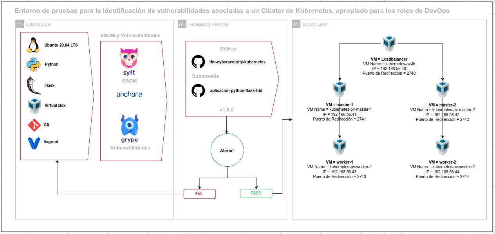

  <h1>Entorno de pruebas para la identificación de vulnerabilidades asociadas a un Clúster de Kubernetes, apropiado para los roles de DevOps</h1>

  <strong>Este repositorio describe de manera funcional lo planteado a en trabajo de fin de master de DevOps</strong>

  El contenido específico en materia metodológica se detalla en el trabajo entregado directamente a los directores del trabajo de fin de master.

 

# Introducción

Todo el trabajo está enfocado en la implementación de un clúster de kubernetes teniendo una infraestructura local basa en Virtual Box y Vagrant.

Para el desarrollo funcional trabajaremos sobre la rama `main` y sobre `develop`

## Componentes principales

Para el desarrollo de la actividad con una mejor clasificación de las funcionalidades del código se tiene proyectos en submódulos de git:

- [TFM Cybersecurity Kubernetes](https://github.com/PetterVargas/tfm-cybersecurity-kubernetes)
- [Aplicación Python Flask TDD](https://github.com/PetterVargas/aplicacion-python-flask-tdd)

# Arquitectura

Para al arquitectura se definio previamente mediante la herramientas [Draw.io](https://app.diagrams.net/)

En la siguiente imagen se describe los componentes de la arquitectura de inicio a fin.

1. Los requerimientos generales para el desarrollo local del proyecto.
2. Seguido de la creación de los SBOM y análisis de vulnerabilidades.
3. Posteriormente validar si se presentan o no vulnerabilidades asociadas al código.
4. En caso de presentarse vulnerabilidades, se debe volver al desarrollo del software y repetir el ciclo.
5. En caso de no presentarse vulnerabilidades desplegar el cluster de kubernetes en virtual box.

## Estructura del repositorio principal

    .tfm-cybersecurity-kubernetes/
        ├── aplicacion-python-flask-tdd/  # Aplicación Flask TDD
        ├── architecture/                 # Arquitectura
        ├── code-security/                # Seguridad en el Código
        ├── deployments/                  # Configuración de despliegue
        ├── docs/                         # Documentación del paso a paso
        ├── docs/images                   # Imágenes de documentación
        ├── vagrant/                      # Infraestructura como código VM
        └── .gitmodules
        └── Makefile 
        └── README.md     

## Objetivos Específicos

* Formular el entorno local que soporte la infraestructura necesario en la implementación de un clúster de kubernetes. [TFM Cybersecurity Kubernetes](https://github.com/PetterVargas/tfm-cybersecurity-kubernetes)
* Diseñar la arquitectura para el entorno de pruebas que incluya los componentes definidos en la documentación oficial de kubernetes. [Arquitectura General del Proyecto](./arquitectura/arquitectura.drawio)
* Desarrollar una aplicación web con la estructura funcional de TDD Test-Driven Development (Desarrollo dirigido por tests). [Aplicación Python Flask TDD](https://github.com/PetterVargas/aplicacion-python-flask-tdd)
* Verificar la seguridad en el código con un análisis estático de vulnerabilidades (Static Application Security Testing - SAST) previo al despligue del entorno local del clúster de kubernetes. [Aplicación Python Flask TDD](https://github.com/PetterVargas/aplicacion-python-flask-tdd)
* Establecer la comunicación de cada componente del clúster de kubernetes para que funcione integral y de manera transparente para el usuario final. [TFM Cybersecurity Kubernetes](https://github.com/PetterVargas/tfm-cybersecurity-kubernetes)
* Implementar el despliegue automatizado del cluster de kubernetes, apropiado para los roles de DevOps. [TFM Cybersecurity Kubernetes](https://github.com/PetterVargas/tfm-cybersecurity-kubernetes)

## Desarrollo específico de la contribución

* [Prerequisitos](/docs/01-prerequisitos.md)
* [Clonar Repositorios](docs/02-clone-repository.md)
* [Aplicación Python Flask TDD](docs/03-aplication-python-flask-tdd.md)
* [SBOM](/docs/04-sbom.md)
* [Vulnerabilidades](docs/05-vulnerabilidades.md)
* [Análisis de Resultados](docs/06-analisis-resultados.md)
* [Remediación de vulnerabilidades](/docs/07-remediacion-vulnerabilidades.md)
* [Networking](docs/08-networking.md)
* [Aprovisionamiento de Recursos](docs/09-aprovisionamiento-recursos.md)

> Parte del código de este repositorio tiene base de [Kelsey Hightower](https://github.com/kelseyhightower/kubernetes-the-hard-way) y [
Mumshad Mannambeth](https://github.com/mmumshad/kubernetes-the-hard-way)