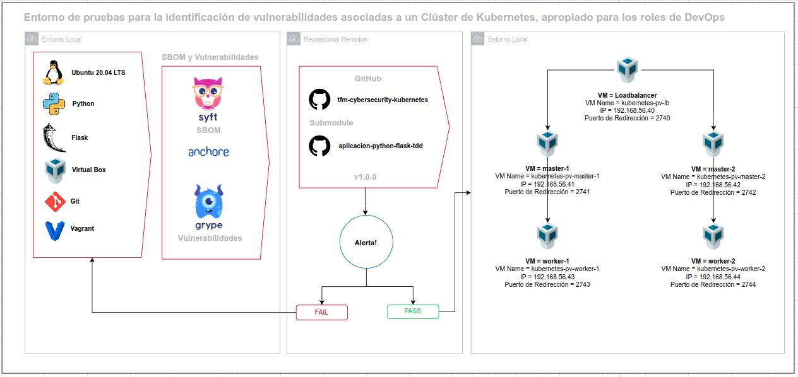

  <h1>Entorno de pruebas para la identificación de vulnerabilidades asociadas a un Clúster de Kubernetes, apropiado para los roles de DevOps</h1>

  <strong>Este repositorio describe de manera funcional lo planteado a en trabajo de fin de master de DevOps</strong>

  El contenido específico en materia metodológica se detalla en el trabajo entregado directamente a los directores del trabajo de fin de master.

 

# Introducción

Todo el trabajo está enfocado en la implementación de un clúster de kubernetes teniendo una infraestructura local basa en Virtual Box y Vagrant.

Para el desarrollo funcional trabajaremos sobre la rama `main` y sobre `develop`

## Componentes principales

Para el desarrollo de la actividad con una mejor clasificación de las funcionalidades del código se tiene proyectos en submódulos de git:

- [TFM Cybersecurity Kubernetes](https://github.com/PetterVargas/tfm-cybersecurity-kubernetes)
- [Aplicación Python Flask TDD](https://github.com/PetterVargas/aplicacion-python-flask-tdd)

# Arquitectura

## Estructura del repositorio principal

    .tfm-cybersecurity-kubernetes/
        ├── aplicacion-python-flask-tdd/  # Aplicación Flask TDD
        ├── architecture/                 # Arquitectura
        ├── docs/                         # Documentación del paso a paso
        ├── docs/images                   # Imágenes de documentación
        ├── vagrant/                      # Infraestructura como código VM
        ├── deployments/                  # Configuración de despliegue
        └── README.md    

## Objetivos Específicos

* Desarrollar una aplicación web con la estructura funcional de TDD Test-Driven Development (Desarrollo dirigido por tests). [Aplicación Python Flask TDD](https://github.com/PetterVargas/aplicacion-python-flask-tdd)
* Verificar la seguridad en el código con un análisis estático de vulnerabilidades (Static Application Security Testing - SAST) previo al despligue del entorno local del clúster de kubernetes. [Aplicación Python Flask TDD](https://github.com/PetterVargas/aplicacion-python-flask-tdd)
* Formular el entorno local que soporte la infraestructura necesario en la implementación de un clúster de kubernetes. [TFM Cybersecurity Kubernetes](https://github.com/PetterVargas/tfm-cybersecurity-kubernetes)
* Diseñar la arquitectura para el entorno de pruebas que incluya los componentes definidos en la documentación oficial de kubernetes. [Arquitectura General del Proyecto](./architecture/arquitectura.drawio)
* Establecer la comunicación de cada componente del clúster de kubernetes para que funcione integral y de manera transparente para el usuario final. [TFM Cybersecurity Kubernetes](https://github.com/PetterVargas/tfm-cybersecurity-kubernetes)
* Implementar el despliegue automatizado del cluster de kubernetes, apropiado para los roles de DevOps. [TFM Cybersecurity Kubernetes](https://github.com/PetterVargas/tfm-cybersecurity-kubernetes)

## Desarrollo específico de la contribución

* [Prerequisitos](/docs/01-prerequisitos.md)
* [Clonar Repositorios](docs/02-clone-repository.md)
* [Aplicación Python Flask TDD](docs/03-aplication-python-flask-tdd.md)

* [Installing the Client Tools](docs/03-client-tools.md)
* [Provisioning the CA and Generating TLS Certificates](docs/04-certificate-authority.md)
* [Generating Kubernetes Configuration Files for Authentication](docs/05-kubernetes-configuration-files.md)
* [Generating the Data Encryption Config and Key](docs/06-data-encryption-keys.md)
* [Bootstrapping the etcd Cluster](docs/07-bootstrapping-etcd.md)
* [Bootstrapping the Kubernetes Control Plane](docs/08-bootstrapping-kubernetes-controllers.md)
* [Installing CRI on Worker Nodes](docs/09-install-cri-workers.md)
* [Bootstrapping the Kubernetes Worker Nodes](docs/10-bootstrapping-kubernetes-workers.md)
* [TLS Bootstrapping the Kubernetes Worker Nodes](docs/11-tls-bootstrapping-kubernetes-workers.md)
* [Configuring kubectl for Remote Access](docs/12-configuring-kubectl.md)
* [Deploy Weave - Pod Networking Solution](docs/13-configure-pod-networking.md)
* [Kube API Server to Kubelet Configuration](docs/14-kube-apiserver-to-kubelet.md)
* [Deploying the DNS Cluster Add-on](docs/15-dns-addon.md)
* [Smoke Test](docs/16-smoke-test.md)
* [E2E Test](docs/17-e2e-tests.md)
* [Extra - Certificate Verification](docs/verify-certificates.md)

