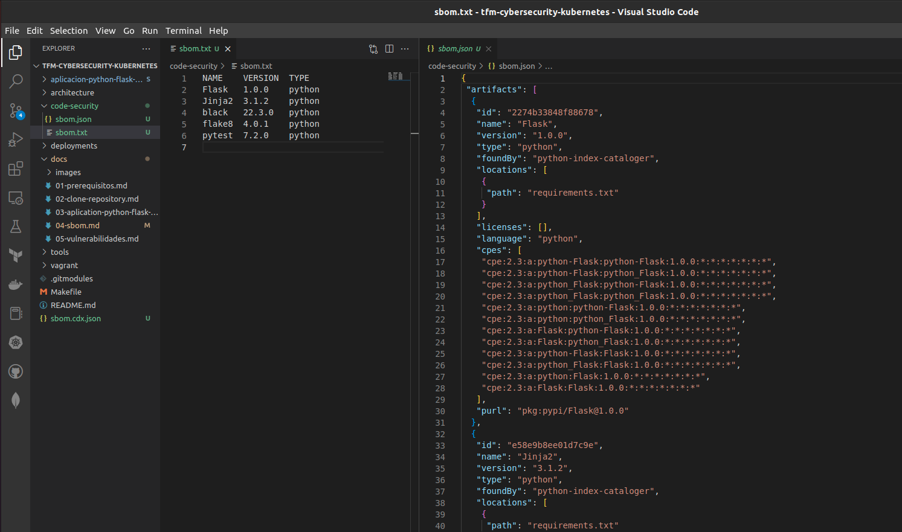

<div align="center">
  <h1>Creación del Bill of Material - SBOM</h1>
</div>

<div align="center">
  Inventario (SBOM) permite reconocer las dependencias del software e identificar la protección en la cadena de suministro del software.
</div><br>

## Table of Content

- [Table of Content](#table-of-content)
- [Cómo lo vamos a ejecutar?](#cómo-lo-vamos-a-ejecutar)
- [Instalación de Syft](#instalación-de-syft)
- [Creación de SBOM con Syft](#creación-de-sbom-con-syft)
- [Validación de la funcionalidad](#validación-de-la-funcionalidad)

## Cómo lo vamos a ejecutar?

Nuestro repositorio objeto de análisis se encuentra como una carpeta dentro de este directorio porque está como submodulo.

## Instalación de Syft

Para instalar Syft debes estar como administrador del sistema operativo o súper usuario

```sh
sudo su
```

Instalación recomendada.

```sh
curl -sSfL https://raw.githubusercontent.com/anchore/syft/main/install.sh | sh -s -- -b /usr/local/bin
```

## Creación de SBOM con Syft
Creación del inventario (SBOM) permite reconocer las dependencias del software e identificar la protección en la cadena de suministro del software.

1. Creación y conversión de un sbom:

```sh
$ syft dir:aplicacion-python-flask-tdd/ > code-security/sbom.txt # Genera a Syft SBOM en formato txt
$ syft -o json dir:aplicacion-python-flask-tdd/ > code-security/sbom.json # Genera a Syft SBOM en formato json
```

2. Para generar todos los SBOM en un mismos comando:

```sh
$ syft dir:aplicacion-python-flask-tdd/ > code-security/sbom.txt && syft -o json dir:aplicacion-python-flask-tdd/ > code-security/sbom.json
```

## Validación de la funcionalidad

Muestra gráfica de la funcionalidad y lo que muestra la aplicación.



Anterior: [Aplicación Python Flask TDD](03-aplication-python-flask-tdd.md)<br>
Siguiente: [Identificación de Vulnerabilidades con Grype](05-vulnerabilidades.md)