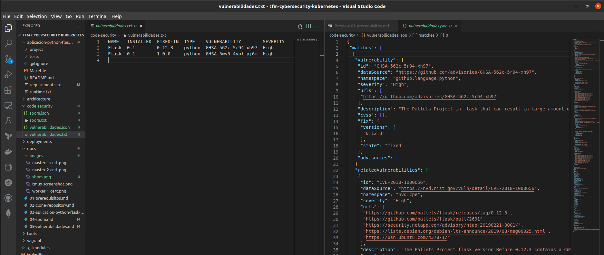

<div align="center">
  <h1>Identificación de vulnerabilidades en el código</h1>
</div>

<div align="center">
  El análisis estático de vulnerabilidades permite identicar las vulnerabilidades asociadas a las depedencias del software
</div><br>

## Table of Content

- [Table of Content](#table-of-content)
- [Cómo lo vamos a ejecutar?](#cómo-lo-vamos-a-ejecutar)
- [Instalación de Grype](#instalación-de-grype)
- [Análisis Estático de Vulnerabilidades SAST](#análisis-estático-de-vulnerabilidades-sast)
- [Validación de la funcionalidad](#validación-de-la-funcionalidad)

## Cómo lo vamos a ejecutar?

Nuestro repositorio objeto de análisis se encuentra como una carpeta dentro de este directorio porque está como submodulo.

## Instalación de Grype

Para instalar Grype debes estar como administrador del sistema operativo o súper usuario

```sh
sudo su
```

Instalación recomendada.

```sh
curl -sSfL https://raw.githubusercontent.com/anchore/grype/main/install.sh | sh -s -- -b /usr/local/bin
```

## Análisis Estático de Vulnerabilidades SAST

Creación de los archivo que nos darán observabilidad sobre las vulnerabilidades asociadas a las dependencias del software.

1. Creación de archivo con la identificación de vulnerabilidades:

```sh
$ grype dir:aplicacion-python-flask-tdd/ > code-security/vulnerabilidades.txt # Genera archivo de vulnerabidades en formato txt
$ grype -o json dir:aplicacion-python-flask-tdd/ > code-security/vulnerabilidades.json # Genera un archivo de vulnerabidades en formato json
```

2. Para generar todos los archivo de vulnerabilidades en un mismos comando:

```sh
$ grype dir:aplicacion-python-flask-tdd/ > code-security/vulnerabilidades.txt && grype -o json dir:aplicacion-python-flask-tdd/ > code-security/vulnerabilidades.json
```

## Validación de la funcionalidad

Muestra gráfica de la funcionalidad y lo que muestra la aplicación.




Siguiente: [Análisis de Resultados](06-analisis-resultados.md)