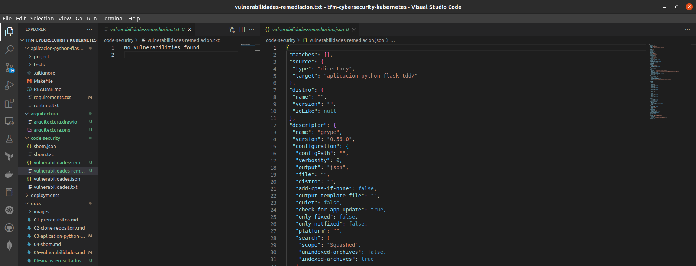

<div align="center">
  <h1>Remediación de Vulnerabilidades</h1>
</div>

<div align="center">
  Llegó el momento de mitigar las vulnerabilidades que nos identificó Grype
</div><br>

## Table of Content

- [Table of Content](#table-of-content)
- [Qué vulnerabilidades tenemos?](#qué-vulnerabilidades-tenemos)
- [Actualización de depedencias](#actualización-de-depedencias)
- [Análisis Estático de Vulnerabilidades SAST - Remediación](#análisis-estático-de-vulnerabilidades-sast---remediación)
- [Validación de la funcionalidad](#validación-de-la-funcionalidad)


## Qué vulnerabilidades tenemos?

|NAME|INSTALLED|FIXED-IN|TYPE|VULNERABILITY|SEVERITY|
|---|---|---|---|---|---|                
|Flask|0.1|0.12.3|python|GHSA-562c-5r94-xh97|High|      
|Flask|0.1|1.0.0|python|GHSA-5wv5-4vpf-pj6m|High|

Bueno, actualmente tenemos dos vulnerabilidades altas asociadas a Flask, la versión que tenemos instalada es la 0.1; nos recomienda actualizar a las 0.12.3 para remediar las vulnerabilidades; pero, como buena práctica es mejor actualizar a la última versión recomendada, siempre y cuando, no afecte las depedencias que ya están en producción.


## Actualización de depedencias

En nuestro repositorio de código es necesario actualizar el archivo de requerimientos e instalar nuevamente las dependencias.

1. Vamos al archivo `requirements.txt`.
2. Cambiamos en el archivo `Flask==0.1` por `Flask==2.2.2`
3. Instalamos nuevamente las depedencias nuevas `pip install -r requirements.txt`
4. Para actualizar el archivo de requerimientos `pip freeze > requirements.txt`


## Análisis Estático de Vulnerabilidades SAST - Remediación

Creación de los archivo que nos darán observabilidad sobre las vulnerabilidades y si se solucionaron.

1. Creación de archivo con la identificación de vulnerabilidades en la remediación:

```sh
$ grype dir:aplicacion-python-flask-tdd/ > code-security/vulnerabilidades-remediacion.txt # Genera archivo de vulnerabidades en formato txt
$ grype -o json dir:aplicacion-python-flask-tdd/ > code-security/vulnerabilidades-remediacion.json # Genera un archivo de vulnerabidades en formato json
```

2. Para generar todos los archivo de vulnerabilidades de remediación con un mismos comando:

```sh
$ grype dir:aplicacion-python-flask-tdd/ > code-security/vulnerabilidades-remediacion.txt && grype -o json dir:aplicacion-python-flask-tdd/ > code-security/vulnerabilidades-remediacion.json
```

## Validación de la funcionalidad

Muestra gráfica de la funcionalidad y lo que muestra la aplicación.




Siguiente: [Análisis de Resultados](06-analisis-resultados.md)