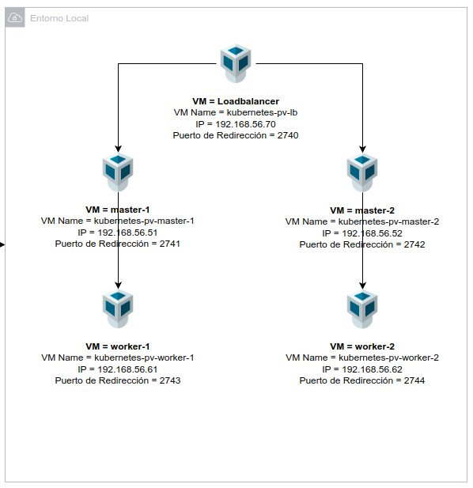
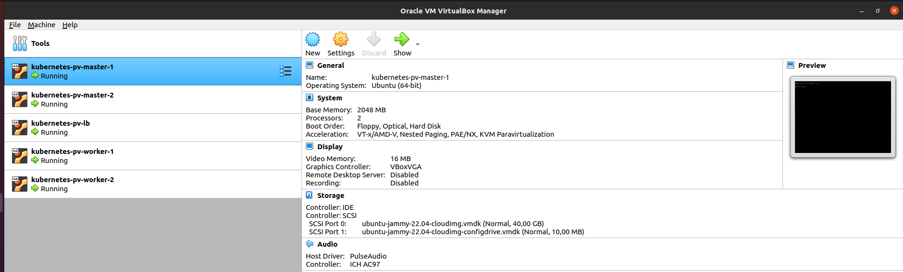

<div align="center">
  <h1>Aprovisionamiento de Recursos en VirtualBox</h1>
</div>

<div align="center">
  Ahora es necesario aprovisionar las máquinas virtuales en nuestro entorno de virtualización VirtualBox
</div><br>

## Table of Content

- [Table of Content](#table-of-content)
- [Ejecutar Vagrant](#ejecutar-vagrant)
- [Cómo quedaría la configuración?](#cómo-quedaría-la-configuración)
- [Validación de la funcionalidad](#validación-de-la-funcionalidad)


## Ejecutar Vagrant

1. Primero debemos acceder al directorio específico de Vagrant.

```shell
cd vagrant
```

2. Segundo debemos ejecutar Vagrant.

```shell
vagrant up
```

## Cómo quedaría la configuración?

Se representa gráficamente la configuración establecida:




## Validación de la funcionalidad

Muestra gráfica de la funcionalidad y lo que muestra la aplicación.



Anterior: [Networking](08-networking.md)<br>
Siguiente: [Análisis de Resultados](06-analisis-resultados.md)